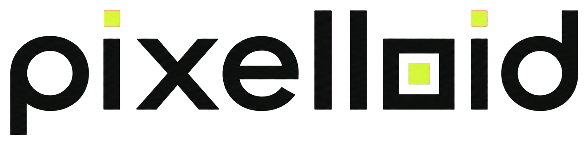
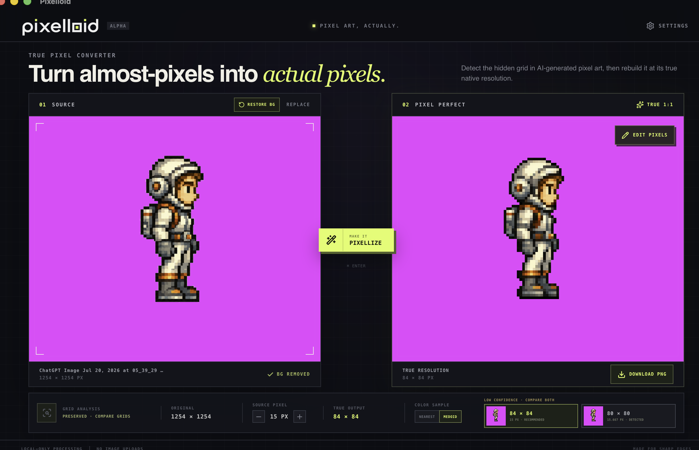
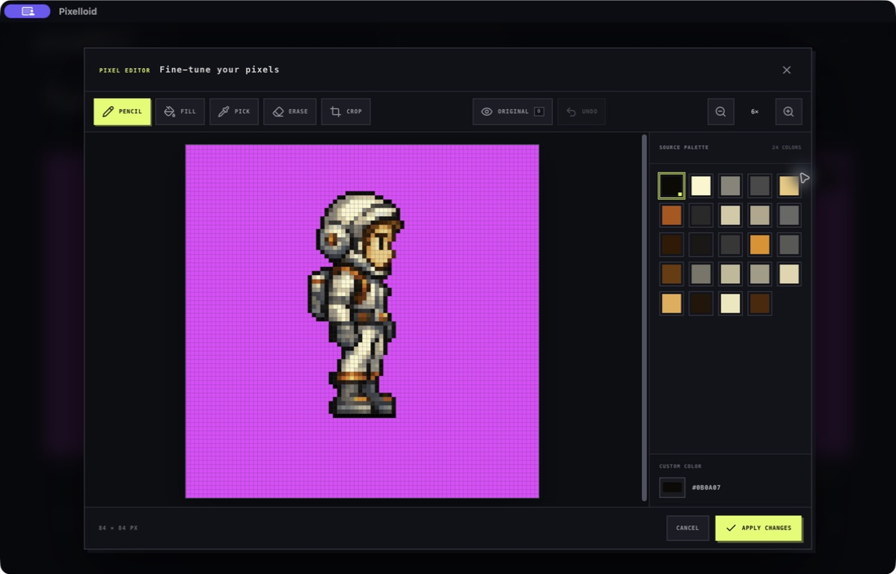

<p align="center">
  <picture>
    <source
      media="(prefers-color-scheme: dark)"
      srcset="./src/assets/pixelloid-wordmark-dark.png"
    />
    <source
      media="(prefers-color-scheme: light)"
      srcset="./src/assets/pixelloid-wordmark.png"
    />
    
  </picture>
</p>

<p align="center">
  Turn enlarged, almost-pixel art into a true 1:1 pixel image.
</p>

## Screenshots

<p align="center">
  
</p>

<p align="center">
  <em>Detect the source grid, remove the background, and compare the true-resolution result using the Medoid sampler.</em>
</p>

<p align="center">
  
</p>

<p align="center">
  <em>Edit individual pixels with pencil, fill, eyedropper, eraser, crop, zoom, and the source palette.</em>
</p>

## What is Pixelloid?

AI-generated pixel art often only looks pixel-perfect. Its apparent pixels are
actually made from many source pixels, softened by interpolation, halos, color
noise, or inconsistent edges.

Pixelloid detects that hidden grid, creates an image at the grid's native
resolution, and resolves every logical cell into one real output pixel. The
entire process runs locally on your computer.

## Features

- Automatic pseudo-pixel grid detection. Weak fractional detections show both
  the information-preserving integer grid and the exact detected grid as
  side-by-side previews.
- Reversible, edge-connected background removal on the source image before grid
  detection and conversion, preserving enclosed artwork.
- Manual source-pixel-size adjustment before conversion.
- Standard nearest-neighbor resampling by default, with an optional
  foreground-phase-aware medoid sampler. Both modes emit complete RGBA colors
  that exist in the source.
- Local conversion to a true-resolution PNG.
- Side-by-side source and result previews.
- Pixel editor with pencil, fill, eyedropper, eraser, crop, undo, custom colors,
  and source-derived palettes.
- Scroll-wheel and button zoom controls.
- A resolution-matched original-image overlay for checking edits.
- Persistent application settings for dark/light themes and the transparency
  chroma-key color.
- PNG, JPEG, WebP, GIF, AVIF, and BMP import. GIF import uses one frame.
- No image uploads, accounts, cloud APIs, or model downloads.

## How conversion works

Pixelloid first estimates the apparent source-pixel pitch and output
resolution. Nearest mode matches FFmpeg/libswscale point sampling. After
background removal, it fits the opaque foreground independently and places it
back on the original logical canvas so transparent padding cannot shift its
pixels. Medoid mode instead aligns the inferred grid to the surviving
foreground and chooses a robust complete RGBA sample observed inside each cell.
Conversion is deterministic and never generates new artwork.

## Development

### Requirements

- Node.js and npm
- A Rust toolchain
- The platform prerequisites required by Tauri 2

Install dependencies and launch the desktop app:

```sh
npm install
npm run tauri dev
```

Run only the Vite frontend:

```sh
npm run dev
```

Run the test suite:

```sh
npm test
```

Build the frontend:

```sh
npm run build
```

Create native release bundles:

```sh
npm run tauri build
```

Pushing a version tag such as `v0.1.0` runs the GitHub release workflow. It
tests the project, builds Linux and Windows x64 installers plus macOS Intel and
Apple Silicon bundles, then attaches them to one GitHub Release.

On macOS, release artifacts are written beneath:

```text
src-tauri/target/release/bundle/
```

## Project structure

```text
src/
├── components/              React UI and pixel editor
├── lib/
│   ├── backgroundRemoval.ts
│   ├── gridDetection.ts
│   ├── imageWorkerClient.ts
│   └── pixelizeCore.ts
└── workers/                 Off-main-thread image processing

src-tauri/                   Tauri application shell and native packaging
tests/                       Grid, pixelization, and background-removal tests
```

## Current limits

- Source images are limited to 40 million decoded pixels.
- Background removal is limited to 4.2 million source pixels to keep its
  full-resolution edge traversal within a safe memory bound.
- Grid suggestions are advisory when the source does not contain one clear,
  consistent lattice.

Pixelloid is currently in alpha.

## License

Pixelloid is available under the
[Mozilla Public License 2.0](LICENSE).
